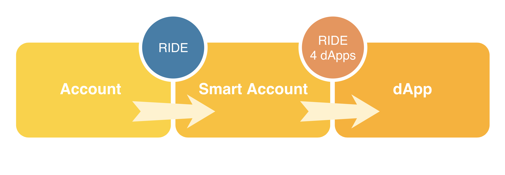

# Ride4DApps

The main goal is to enable classic _**'DApps'**_ approach on Waves by adding the ability to define functions in a contract.



## Functions Types

In RIDE4DApps, we introduce two types of functions: Callable functions and Verifier function.

### Verifier Function

It works exactly like current ride script\(which is an expression that returns a BOOLEAN\) as following:

```js

@Verifier(tx)
func verify() = {
let a = ...
let b = ...
(a || b) && sigVerify(tx...)
}

```
 tx is no longer part of global context, but the actual transaction object is bound through @Verifier annotation. 

### **Callable Functions**

The dApp script describes functions that can be called **_"callable functions"_**.
Those functions are invoked using **_InvokeScriptTransaction_**, which specifies:
* Account that calls the script.
* Account contract whose script is called.
* Name and arguments of the function being called
* Optionally - an attached payment (the account that calls the script can pay the contract account).


For accessing the data of an invoked function \(such as getting how many waves/tokens were attached\), You need to use _**@Callable\(inv\)**_ binding where the parameter _**inv**_ is of type _**Invocation**_. Basically _**Invocation**_ is a data structure of:

* caller: Address.
* payment: Payment\|Un, where Payment consist of amount: Long and assetId: ByteVector \| Unit.

Unlike verifier function, _**Callable function**_ can return one of:

* _**WriteSet,**_ It's a keyValue list which defines what data will be stored in contract's account upon contract invocation.
* _**TransferSet,**_ It's a keyValue list which defines what outgoing payments will be made upon contract invocation.
* **_ContractResult,_** It's the combination of WriteSet and TransferSet.

**_The sender pays fees(1 + 4*(the cost of each script involved))_** to the miner for the invocation. The sender can optionally attach payment in WAVES or tokens, and upon invocation the contract state can be changed and the contract can make multiple payments. By default, a contract’s attributes (the contract itself, contract data and contract tokens) are controlled by the account’s private key.

 In addition, there’re functions that are not Verifier and are not Callable which means that they cannot be called via InvokeScriptTransaction but can be called by other functions. In this case, you need to define this kind of functions at the begging of your code before any callable or verifier functions which means that recursive calls is not possible 