# Simple voting on the Waves blockchain

The head of the HOA (homeowners association) asks the tenants of the building: "Dear residents, do you agree with the construction of the kids' playground in the yard of your building?".

Objective: implement such voting among tenants on the Waves blockchain.

## Roadmap

1. Create an [account](/blockchain/account.md) of the head of the HOA.
2. Create accounts of tenants.
3. Create [dApp script](/ride/script/script-types/dapp-script.md) with the `vote` method.
4. Attach dApp script to the account of the head of the HOA, thus creating a [dApp](/blockchain/account/dapp.md).
5. Vote from the accounts of tenants by invoking the `vote` method of the dApp.
6. View the results of the voting.

## 1. Creation of the account of the head of the HOA

Go to the [Waves IDE](https://ide.wavesplatform.com) settings.

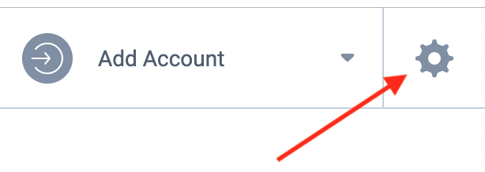

Make sure that the [test network](/blockchain/blockchain-network/test-network.md) is selected.


Create an account of the head of HOA by selecting **Generate New Account**.


Rename created account to "Head of HOA".

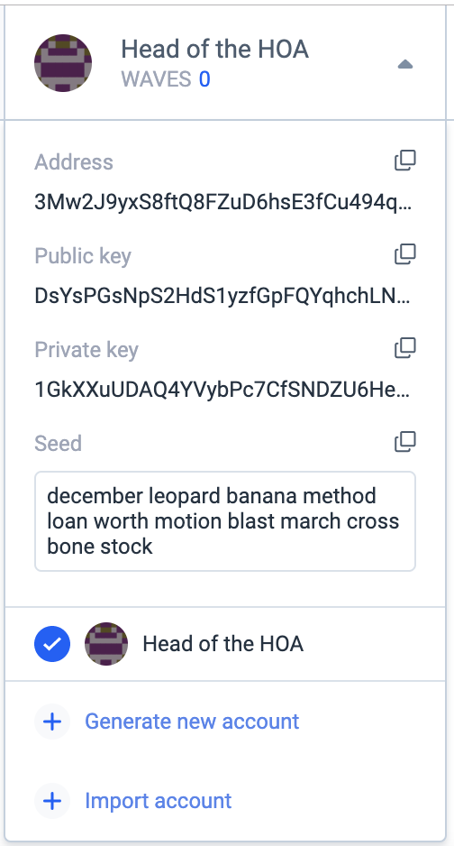

Copy the [address](/blockchain/account/address.md) of the head of HOA and top up its balance by 10 [WAVES](/blockchain/token/waves.md) using the [Faucet](/waves-explorer/account-balance-top-up-in-the-test-network.md). The head of HOA will need [tokens](/blockchain/token.md) to pay the [fee](/blockchain/transaction/transaction-fee.md) for the set script transaction when he will be attaching [dApp script](/ride/script/script-types/dapp-script.md) to his account.

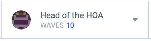

## 2. Creation of accounts of tenants

Similarly, create accounts of tenants Aleksei and Anna and top up their balances by 10 WAVES. They will need tokens to pay a fee for the [invoke script transaction](/blockchain/transaction-type/invoke-script-transaction.md) when they will vote by calling the `vote` method of the dApp.


## 3. Creation of a dApp script

Create a [dApp script](/ride/script/script-types/dapp-script.md) by selecting **DApp** in the drop-down list.

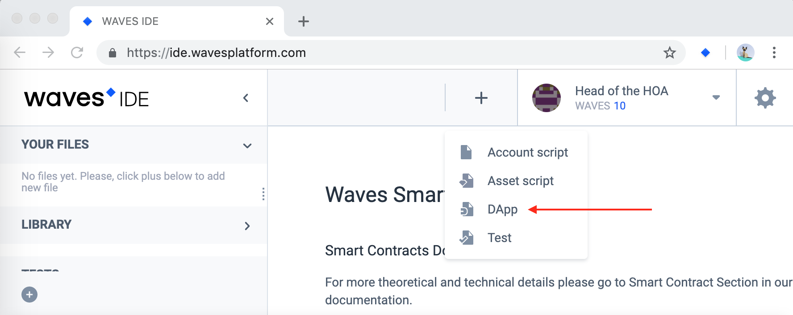

Rename the script to the "Head of the HOA voting".

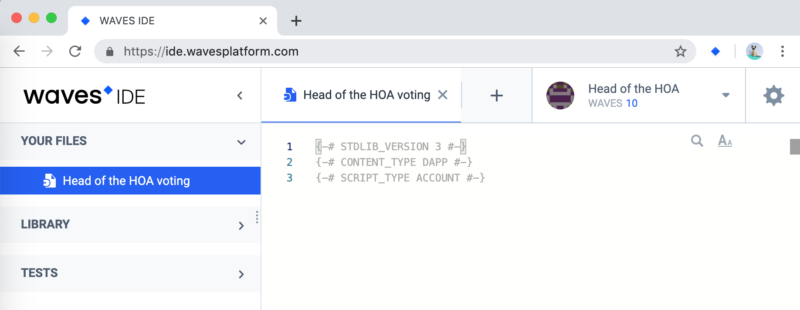

Replace automatically generated code with the following:

```ride
{-# STDLIB_VERSION 3 #-}
{-# CONTENT_TYPE DAPP #-}
{-# SCRIPT_TYPE ACCOUNT #-}

func voterIsAllowedToVote(voterPublicKey: ByteVector) = {

    let alekseiPubKey = base58'8t38fWQhrYJsqxXtPpiRCEk1g5RJdq9bG5Rkr2N7mDFC'
    let annaPubKey = base58'BqHZaEwUMvoF8HKNC69gkHwQwHnw5FX9i67DJSH78z9E'

    if (voterPublicKey != alekseiPubKey && voterPublicKey != annaPubKey)
    then
        false
    else
        true

}

@Callable(i)
func vote(theVote: Int) = {

    if(!voterIsAllowedToVote(i.callerPublicKey))
    then
        throw("You can not vote because you are not in the list of voters!")
    else
        let dataFromStorage = this.getInteger(i.callerPublicKey.toBase58String())

        if(dataFromStorage.isDefined())
        then
            throw("You have already voted! Voting the second time is not allowed.")
        else
            WriteSet([DataEntry(i.callerPublicKey.toBase58String(), theVote)])

}
```

### Explanation of the code of the dApp script

#### The `vote` function

The `vote` function returns the `WriteSet` [structure](/ride/structures.md), inside of which takes place the recording of the vote to the [account data storage](/blockchain/account/account-data-storage.md) of the head of the HOA.

In front of the `vote` function, there is a `@Callable` annotation which makes the dApp function callable. The `i` is the variable that contains the information about transaction which invoked the `vote` function. In the code we use variable `i` to get public key of the account which sent the invoke script transaction.

To keep things simple, there are no checks of the value of the `theVote` variable in the code.

#### The `voterIsAllowedToVote` function

The `voterIsAllowedToVote` function checks if the account that invoked the script has rights to vote.

In the current example the values of public keys are hardcoded in the script. In the real world example, it will be better to read public keys, for example, from the data storage of the account of the head of the HOA (after saving them there beforehand).

Get the values of `alekseiPubKey` and `annaPubKey` from the accounts' cards of Aleksei and Anna.

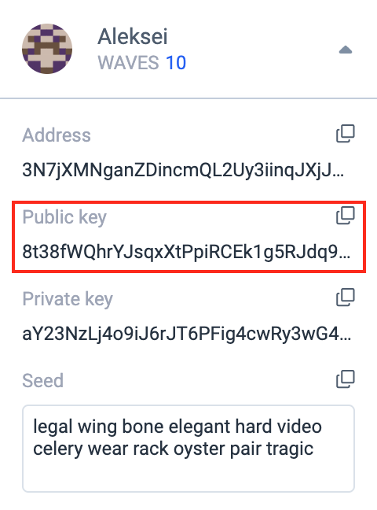

#### The `getInteger` function

The `getInteger` function gets values of the account data storage by key:

```
let dataFromStorage = this.getInteger(i.callerPublicKey.toBase58String())
```

The size and the [complexity](/ride/base-concepts/complexity.md) of the script is displayed in the panel underneath the script editor.

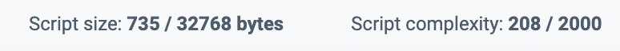

## 4. Attaching dApp script to the account of the head of the HOA

Press the **Deploy dAppscript** button.


In the opened window, in the **Account** combo box, select the "Head of the HOA" value. Sign the transaction by pressing **Add sign**.

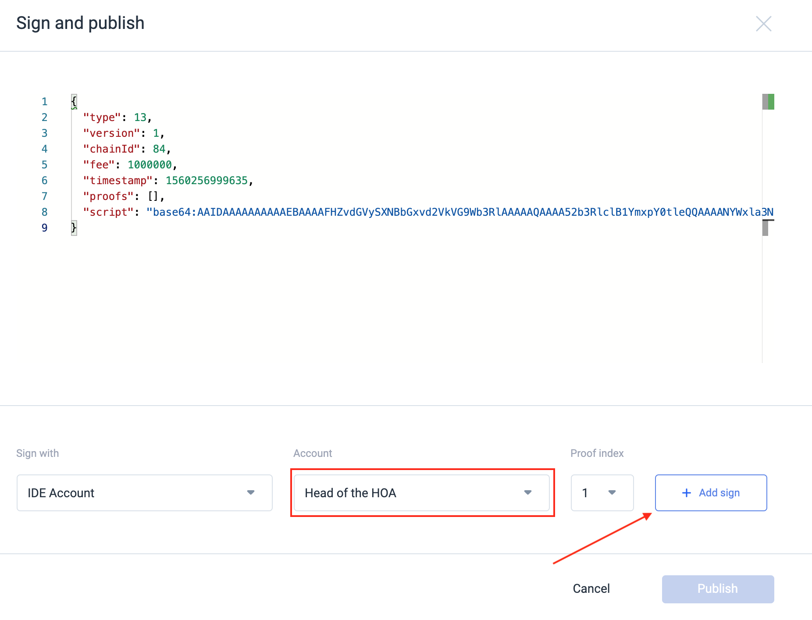

Note that you can also sign a transaction with a seed phrase or using the [Waves Keeper](/waves-keeper/about-waves-keeper.md).

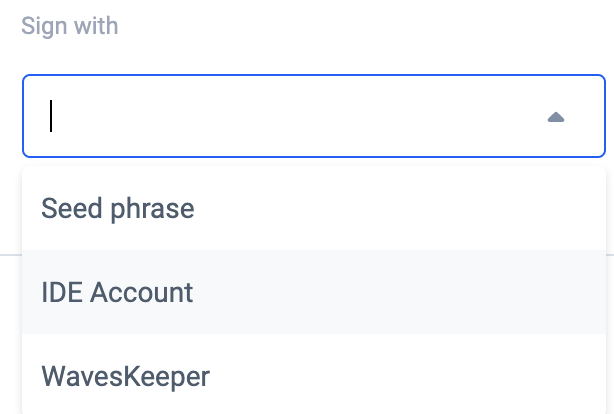

Send a [set script transaction](/blockchain/transaction-type/set-script-transaction.md) from the account of the head of the HOA by pressing **Publish**. By doing so, you just created a [dApp](/blockchain/account/dapp.md).


In the [Waves Explorer](https://wavesexplorer.com/testnet), in the _test network_, find the information about the activity on the account of the head of the HOA. Enter the address of the head of the HOA in the search bar and press **Enter**.


There are two transactions on the head of the HOA's address: the [transfer transaction](/blockchain/transaction-type/transfer-transaction.md) (balance top up by 10 WAVES using the Faucet) and the set script transaction. Note that the commission of 0.001 WAVES was charged from the head of the HOA's balance for the set script transaction.

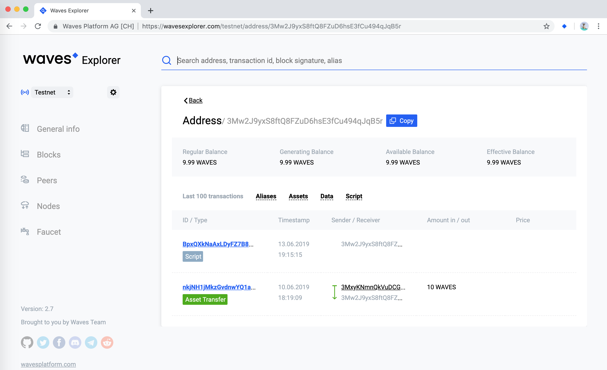

## 5. Voting

In order to vote a resident must send an invoke script transaction from his account. In the transaction he must specify the address of the dApp, the name of the method to call, and the passed parameters.
Send an invoke script transaction from Aleksei's account using [REPL](/smart-contracts/tools/repl.md). First, _select Aleksei's account_ in the Waves IDE.

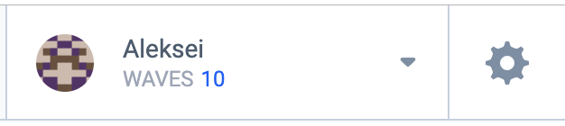

Then in the REPL execute the following command:

```ride
broadcast(invokeScript({dApp: "3Mw2J9yxS8ftQ8FZuD6hsE3fCu494qJqB5r", call: {function: "vote", args: [{type: "integer", value: 7}]} }))
```

Here `3Mw2J9yxS8ftQ8FZuD6hsE3fCu494qJqB5r` is the address of the account of the head of the HOA.

If everything went right, you will see the following result (expand the `Promise` object in the console):

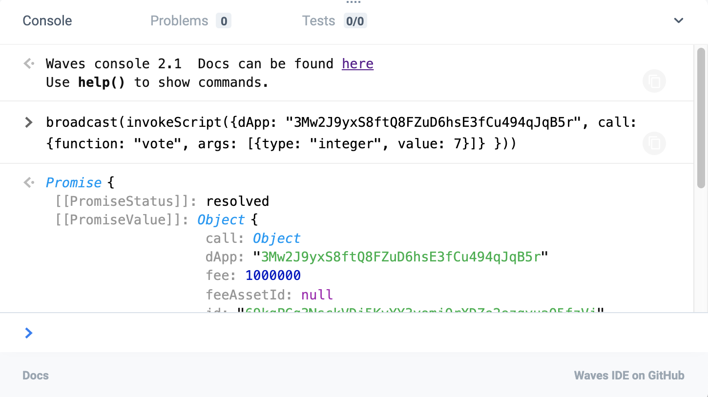

Similarly, vote from Anna's account, _after selecting Anna's account_ in the Wave IDE:

```ride
broadcast(invokeScript({dApp: "3Mw2J9yxS8ftQ8FZuD6hsE3fCu494qJqB5r", call: {function: "vote", args: [{type: "integer", value: 25}]} }))
```

If you will try to vote again from Aleksei's or Anna's accounts, you will see the error:

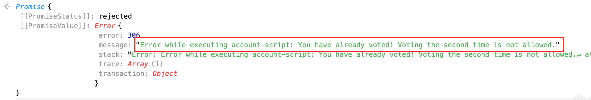

If you will try to vote from the account of the head of the HOA, you will see the error:

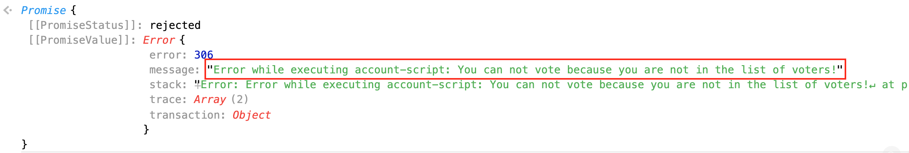


## 6. Viewing the results of the voting

Take a look at the contents of the head of the HOA's account data storage on the **Data** tab in the Waves Explorer — there are two records in the account data storage.

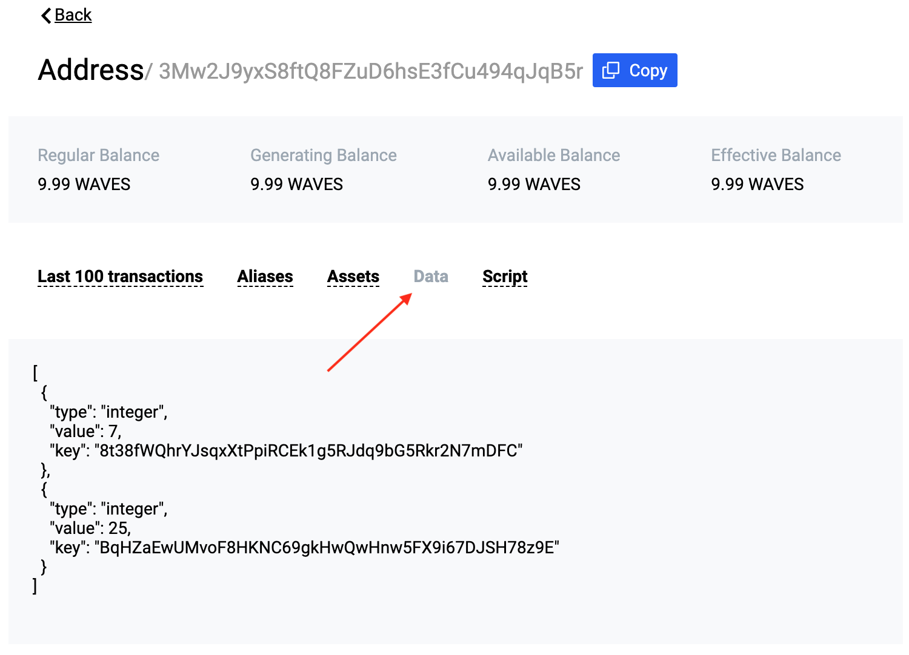
