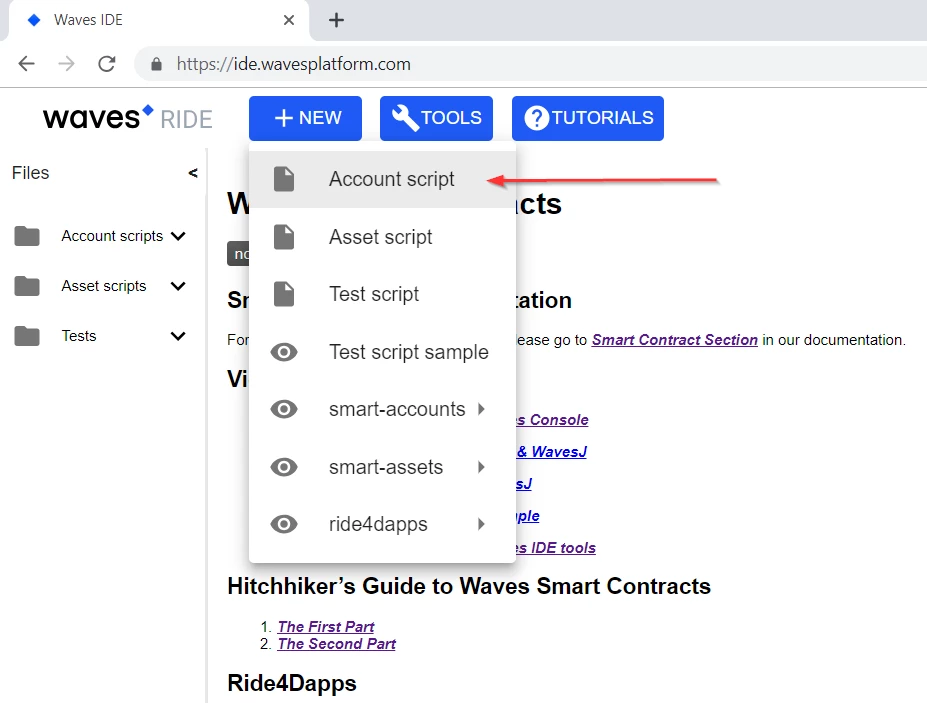
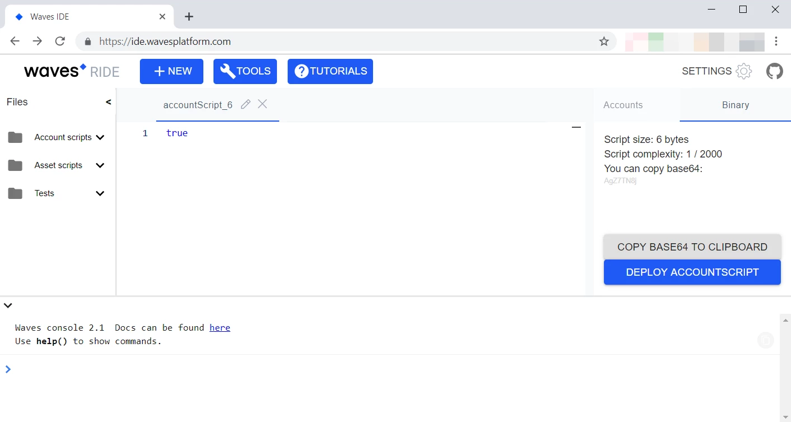

# Writing dApps
## Default transactions validation
After the creation of a Waves account, each transaction that's sent from this account goes through the process of validation. If a transaction is valid, then it goes to generated block in the blockchain, if not — it's rejected by blockchain.

By default, _only_ the fact that the transaction belongs to the owner of the account from which it was sent, is checked. To check that, the transaction's binary data, the account owner's public key and the digital signature of the transaction are being run through special `sigVerify` function. If the `sigVerify` function returns `true` — the transaction is considered valid, otherwise — invalid.

## Transactions validation using account scripts
If a validation algorithm has to have some additional logic that goes beyond only the detection of transaction's ownership, then a special script written in RIDE is used. This script is attached to the account. That kind of script is called the **account script**. After the attachment of the script to the account, all the transactions that are sent from this account will be verified with this script.

## IDE for writing account scripts
We are using [Waves IDE](http://ide.wavesplatform.com/) as our IDE for writing RIDE scripts. To create a new script let's click the **New** button and select the **Account script** option.


A new tab will open, inside of which we can start writing our RIDE script.


## Working with transaction object inside of the account script
An account script has the context containing a few useful variables. One of such variables is the variable `tx`, that contains within itself the information about the transaction that's validated by the account script. There are [several types of transactions](/waves-node/node-api/transactions.md) exist in the Waves blockchain. Inside of the account script we have to have an ability to determine the type of a transaction. Type casting is possible due to the `match` operator:
```
let accountPubKey = base58'9xPqZ7fhgKxRsgkbahawNMsgHhM9TMYa3SXwNmn3bvyS'
 
match (tx)
{
    case t: TransferTransaction =>
        sigVerify(tx.proofs[0], tx.bodyBytes, accountPubKey)
        &&
        t.amount < 100
 
    case t: IssueTransaction =>
        sigVerify(tx.proofs[0], tx.bodyBytes, accountPubKey)
 
    case _ =>
        false
}
```
In the example above we are stating that if the sent transaction is a Transfer-transaction, and also the sum of the transfer is less than a 100 of tokens, then we are allowing such a transaction. We are also allowing any transaction of Issue type. All other types of transactions we are forbidding to send from the account.

## The structure of a decentralised application
A decentralised application consists of the following elements:
- Directives
- The context of the script
- Definitions of the callable functions
- Definition of the validation function

The order in which the elements are defined inside of a dApp is important — elements have to be put in the exact same order as listed above.

## Directives
Because the compiler works with the different kinds of RIDE scripts, it needs additional information to work properly. That's why it's recommended to use directives in all of the scripts, otherwise, the default values will be applied, and that may cause some unexpected behaviour.

Here is the set of directives for dApps:
```
{-# STDLIB_VERSION 3 #-}
{-# SCRIPT_TYPE ACCOUNT #-}
{-# CONTENT_TYPE DAPP #-}
```
STDLIB_VERSION 3 — version of the Standard Library.

SCRIPT_TYPE ACCOUNT — directive that indicates that we are working with an account script (not an asset script).

CONTENT_TYPE DAPP — directive that indicates that the script we are working with is a dApp.

## Script context
Script context is a context where some immutable variables and functions could be defined, that will be accessible within the boundaries of the entire dApp.
```
let someConstant = 42
func doSomething() = {
    1+1
}
```
## Definitions of the callable functions
Here we can define functions, that will be called with Invoke Script-transactions. Such functions are adorned with `@Callable(contextObj)`, where `contextObj` is an arbitrary name of the context object. The context object contains the following fields:

- `caller` — the account address, which called the function.
- `callerPublicKey` — the public key of the account, which called the function.
- `payment` — the payment that's attached to the function call. The payment can be empty (UNIT).

A callable function can use the functions and the values from the script context (see above) and from its own context.
```
@Callable(contextObj)
func foo() = {
   if (contextObj.caller == this)
   then
       ScriptResult(
            WriteSet([DataEntry("someDataKey", 42)]),
            TransferSet([ScriptTransfer(contextObj.caller, 100500, unit)])
        )
   else
       throw("Only owner can use this function.")
}
```
## Definition of the validation function
The validation function in a dApp plays the role of the account script — it validates all the outgoing from this account transactions.

Such a function is adorned with the `@Verifier(tx)` annotation, where `tx` is the transaction, which the function is currently validating. Available fields of the transaction (different by transaction type) you can see at the [Functions and Standard Library](/smart-contracts/ride-language/standard-library.md) page.

Possible execution results:

- `true`
- `false`
- an error

If a dApp doesn't have the validation function, then the default validation algorithm is applied to all the outgoing transactions (see the `sigVerify` function mentioned earlier).

The example of a function, that permits only Transfer-transactions (any other types of transactions will not be allowed to be sent from such an account):
```
@Verifier(tx)
func verify() = {
    match tx {
        case ttx:TransferTransaction => sigVerify(ttx.bodyBytes, ttx.proofs[0], ttx.senderPublicKey)
        case _ => false
    }
}
```
## InvokeScriptTransaction function parameters
| Parameter name |Parameter type |Description  |
|---|---|---|
|  type  |Int   |  transaction type (16 for the InvokeScript) |
| dApp   | Address  | address of the account to which dApp is attached  |
|  payment  | OPTION[AttachedPayment]  | payment (amount, asset type) |
|  fee  |  Int | fee amount  |
| feeAssetId | OPTION[ByteVector] | fee asset identifier (null for WAVES)|
|  call: <br /> - function <br /> -args | <br /> String <br />LIST[UNION(Boolean,ByteVector,Int,String)]  | <br /> the name of the callable function <br /> the list of the passed arguments |
|  id  | ByteVector  |  transaction identifier |
|  timestamp  |  Int | transaction execution time  |
|  version  | Int  |  the version of the transaction (currently it's 1) |
|  sender  |  Address |  the address of the account that makes a call to the function |
|  senderPublicKey  | ByteVector  |  the public key of the account that makes a call to the function |
| proofs   | LIST[ByteVector]  |  the list of signatures that prove the authenticity of the transaction |
|  chainId |  Byte | blockchain network identifier <br /> "T" — testing <br /> "W" — working (production)  |

## JSON of the InvokeScript-transaction
```
{
 
  "type": 16,
  "version": 1,
  "senderPublicKey": "2GEvUnpNpve2rSAs51c2HMTkaCYW9QRgwR16Z2HGJZgC",
  "dApp": "3FYR1f5YydHXF8dtfRJRyX3PoDCoT7a36Kq",
  "call": {
    "function": "deposit",
    "args": []
  },
  "payment": [
    {
      "amount": 200000000,
      "assetId": null
    }
  ],
  "fee": 1000000,
  "feeAssetId": null,
  "timestamp": 1555073997308,
  "chainId": 68,
  "proofs": [
      "42Tf6VSVi3Cq6yHK1ENcVtyQbt9Ap8fcu57gYoZWChJTPPz52qRDM5NThuhFDVB4qE2gPZonuvjEJVtWHVYyNvJC"
  ],
  "id": "2fcMC9ihuLAcGNsbiSLDgz8dekq2JkrtjihroUiyNYCp"
}
```
## The example of a dApp
```
# Directives
{-# STDLIB_VERSION 3 #-}
{-# CONTENT_TYPE DAPP #-}
{-# SCRIPT_TYPE ACCOUNT #-}
 
# Block of the context script.
# The block is empty.
 
# Callable function that accepts payments from other accounts and deposits them to the account to which the dApp is attached to.
@Callable(i)        # Context object with the name "i".
func deposit() = {
   let pmt = extract(i.payment)
   if (isDefined(pmt.assetId)) then throw("can hold waves only at the moment")
   else {
        let currentKey = toBase58String(i.caller.bytes)
        let currentAmount = match getInteger(this, currentKey) {
            case a:Int => a
            case _ => 0
        }
        let newAmount = currentAmount + pmt.amount
        WriteSet([DataEntry(currentKey, newAmount)])
   }
}
 
# Callable function that withdraws from the account, to which the dApp is attached to.
@Callable(i)                    # Context object with the name "i".
func withdraw(amount: Int) = {
        let currentKey = toBase58String(i.caller.bytes)
        let currentAmount = match getInteger(this, currentKey) {
            case a:Int => a
            case _ => 0
        }
        let newAmount = currentAmount - amount
     if (amount < 0)
            then throw("Can't withdraw negative amount")
    else if (newAmount < 0)
            then throw("Not enough balance")
            else ScriptResult(
                    WriteSet([DataEntry(currentKey, newAmount)]),
                    TransferSet([ScriptTransfer(i.caller, amount, unit)])
                )
    }
 
# Valiation function — validates all the outgoing from the account transactions.
@Verifier(tx)
func verify() = {
    sigVerify(tx.bodyBytes, tx.proofs[0], tx.senderPublicKey)
}
```
