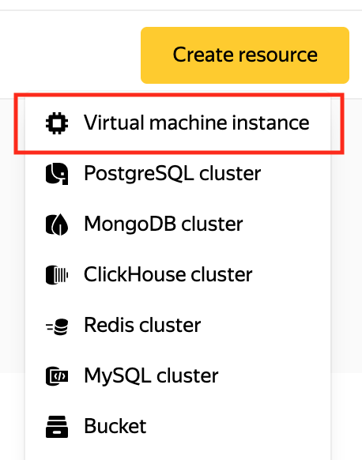
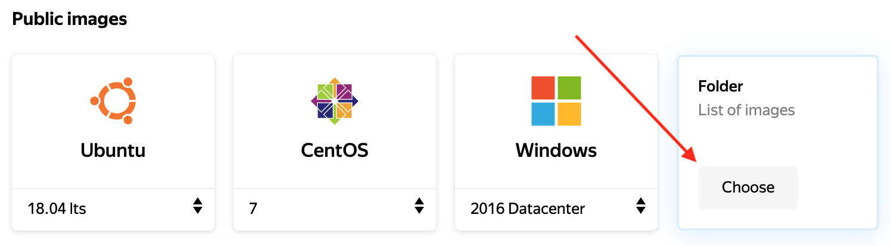
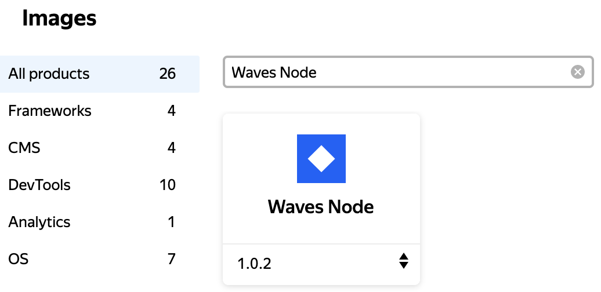
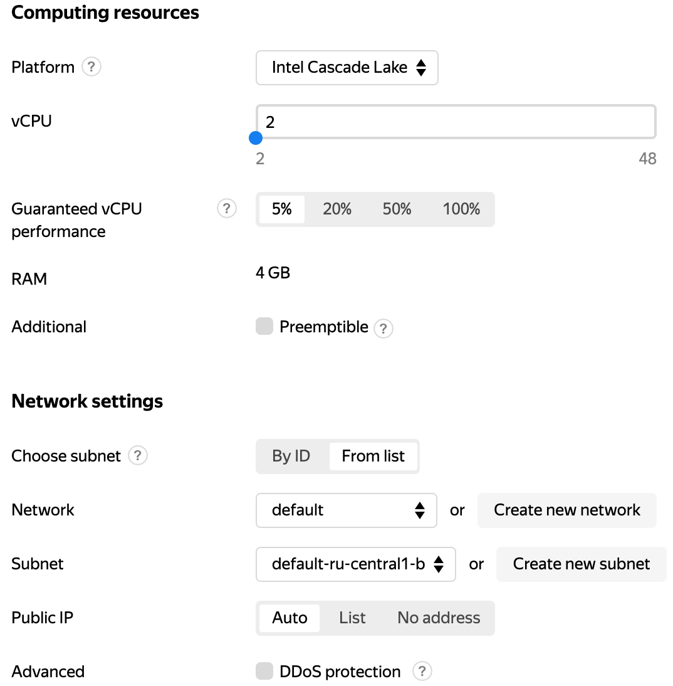
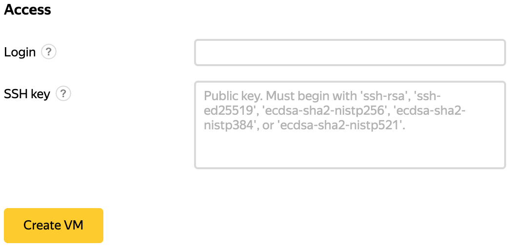
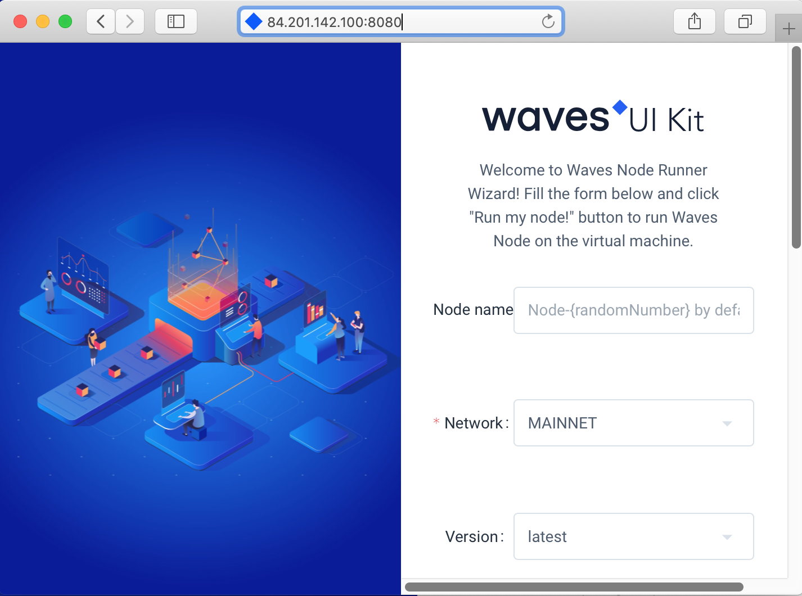

# Running Waves Node in Yandex.Cloud

1.&nbsp;In the Yandex.Cloud [console](https://console.cloud.yandex.com), navigate to the desired resource group.

 <br>

2.&nbsp;At the top right corner of the screen, click **Create resource**. Select **Virtual machine instance**.

 <br>

3.&nbsp;Go to **List of images**.

 <br>

4.&nbsp;Enter **Waves Node** in the search box. Select the Waves Node image.

 <br>

5.&nbsp;Set the parameters of the virtual machine. See the [Hardware requirements](/waves-node/prerequisites/hardware-requirements.md) page for minimum hardware requirements to start the node.

 <br>

6.&nbsp;[Generate](https://cloud.yandex.com/docs/compute/operations/vm-connect/ssh#creating-an-ssh-key-pair) a pair of SSH keys. Enter the public key of the pair in the **SSH key** field. Complete creation of the virtual machine by clicking **Create VM**.

 <br>

7.&nbsp;Make sure that the virtual machine is running by [connecting](https://cloud.yandex.com/docs/compute/operations/vm-connect/ssh#vm-connect) to it via SSH. Copy the IP address of the machine from the control panel of Yandex.Cloud.

``` console
ssh <username>@<virtual_machine_ip_address>
```

8.&nbsp;In a browser navigate to the page http:&#47;&#47;&lt;virtual&#95;machine&#95;ip&#95;address&gt;:8080 to start docker container with [Waves Node](https://github.com/wavesplatform/Waves).

 <br>

9.&nbsp;Set the necessary settings. When ready, click **Run my node!**. The docker container will start with the settings you have specified.

10.&nbsp;Make sure that the container is running by running the [docker ps](https://docs.docker.com/engine/reference/commandline/ps) command in the virtual machine console.

``` console
sudo docker ps
```
