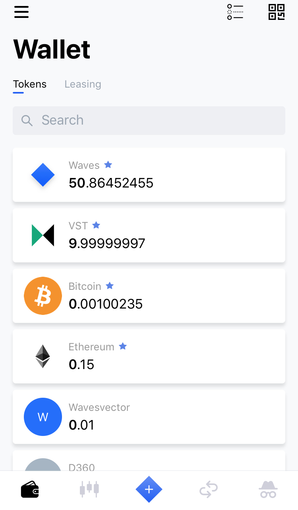
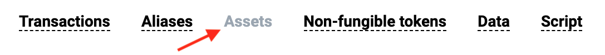

# Баланс аккаунта

**Баланс аккаунта** — количество [токена](/blockchain/token.md), которое хранится на [аккаунте](/blockchain/account.md).

Один аккаунт может хранить разные токены в разных количествах. Например, на аккаунте может одновременно храниться 50 [WAVES](/blockchain/token/waves.md) и 200 [WCT](/blockchain/token/wct.md). Количество токена Y на аккаунте называется **балансом аккаунта в токене Y**. Если на аккаунте нет токена Y, то говорят, что **баланс аккаунта в токене Y равен нулю**.

## Баланс в токене WAVES

Существуют четыре вида баланса в токене WAVES:

* регулярный
* эффективный
* доступный
* генерирующий

На аккаунте кроме WAVES владельца аккаунта, могут храниться WAVES, которые принадлежат другим аккаунтам — это WAVES, которые были сданы в [лизинг](/blockchain/leasing.md).

**Регулярный баланс** — количество WAVES на аккаунте, которое принадлежит непосредственно владельцу аккаунта.

Для объяснения эффективного и доступного балансов введем следующие обозначения:

`A` — регулярный баланс,

`L` — количество WAVES, которое аккаунт отдал в лизинг другим аккаунтам,

`R` — количество WAVES, которое аккаунт получил в лизинг от других аккаунтов.

**Эффективный баланс** это:

```
A - L + R
```

**Доступный баланс** это:

```
A - L
```

**Генерирующий баланс** — минимальное значение эффективного баланса аккаунта за последние 1000 [блоков](blockchain/block.md).

## Пополнение и просмотр баланса аккаунта

Купить и продать токены можно с помощью приложений [Waves Wallet](https://wavesplatform.com/technology/wallet) и [Waves DEX](https://dex.wavesplatform.com) или на одной из [централизованных бирж](https://coinmarketcap.com/currencies/waves/#markets).

Посмотреть баланс аккаунта можно в Waves Wallet, Waves DEX, а также в расширение для браузера [Keeper](https://wavesplatform.com/technology/keeper).

Пример окна в Wallet со списком токенов на аккаунте:



Посмотреть список токенов на аккаунте можно в [Waves Explorer](https://wavesexplorer.com) — для этого найдите аккаунт по его [адресу](/blockchain/account/address.md) или [псевдониму](/blockchain/account/alias.md) и перейдите во вкладку **Assets**.



## Получение баланса аккаунта с помощью Node API

Получить баланс аккаунта в WAVES можно с помощью запроса к Node API.

Пример запроса:

```
curl https://nodes.wavesplatform.com/addresses/balance/details/<адрес аккаунта>
```

Пример ответа:

```
{
  "address": "3PMCn1EHq4WrsfUazezyYu23H1gHKvuffER",
  "regular": 6086358429,
  "generating": 5086358429,
  "available": 5086358429,
  "effective": 5086358429
}
```
