# Простое голосование на блокчейне Waves

Глава ТСЖ (товарищества собственников жилья) задает вопрос жильцам дома: "Уважаемые жильцы, согласны ли вы со строительством детской площадки во дворе вашего дома?".

На блокчейне Waves необходимо реализовать голосование жильцов дома за строительство детской площадки.

## План действий

1. Создадим [аккаунт](/blockchain/account.md) главы ТСЖ.
2. Создадим аккаунты жильцов дома.
3. Создадим [dApp-скрипт](/ride/script/script-types/dapp-script.md) с методом `vote`.
4. Привяжем dApp-скрипт к аккаунту главы ТСЖ, создав таким образом [dApp](/blockchain/account/dapp.md).
5. Проголосуем с аккаунтов жильцов дома, вызвав метод `vote` dApp.
6. Узнаем результаты голосования.

## 1. Создание аккаунта главы ТСЖ

Зайдите в настройки [Waves IDE](https://ide.wavesplatform.com/).


Убедитесь, что выбрана [тестовая сеть](/blockchain/blockchain-network/test-network.md).

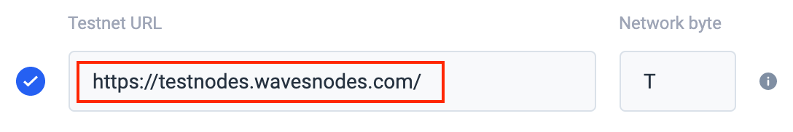

Создайте аккаунт главы ТСЖ, выбрав  **Generate new account**.

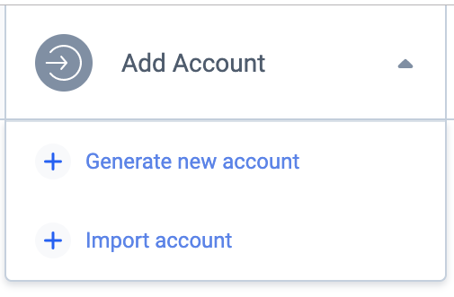

Переименуйте созданный аккаунт в "Глава ТСЖ".

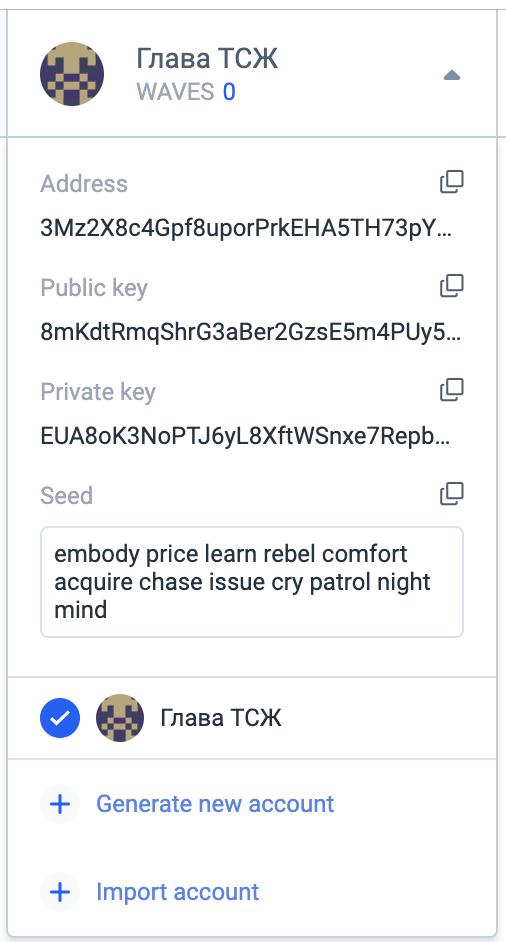

Скопируйте [адрес](/blockchain/account/address.md) главы ТСЖ и [с помощью Faucet](/waves-explorer/account-balance-top-up-in-the-test-network.md) пополните его баланс на 10 [WAVES](/blockchain/token/waves.md). [Токены](/blockchain/token.md) понадобятся главе ТСЖ для оплаты [комиссии](/blockchain/transaction/transaction-fee.md) за [транзакцию установки скрипта](/blockchain/transaction-type/set-script-transaction.md), когда он будет привязывать [dApp-скрипт](/ride/script/script-types/dapp-script.md) к своему аккаунту.

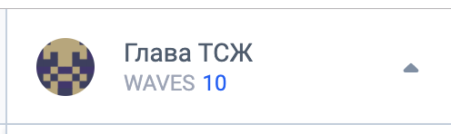

## 2. Создание аккаунтов жильцов дома

Аналогично создайте аккаунты жильцов дома Алексея и Анны и пополните их балансы на 10 WAVES. Токены им понадобятся для оплаты комиссии за [транзакцию вызова скрипта](/blockchain/transaction-type/invoke-script-transaction.md), когда они будут голосовать, вызывая метод `vote` dApp.

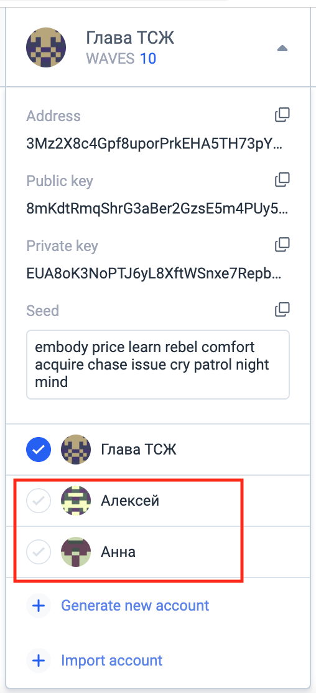

## 3. Создание dApp-скрипта

Создайте [dApp-скрипт](/ride/script/script-types/dapp-script.md), выбрав в выпадающем списке **DApp**.

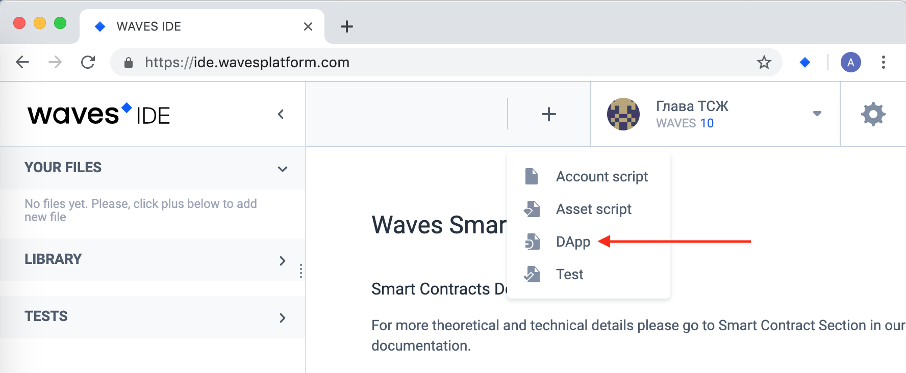

Переименуйте скрипт в "Голосование главы ТСЖ".

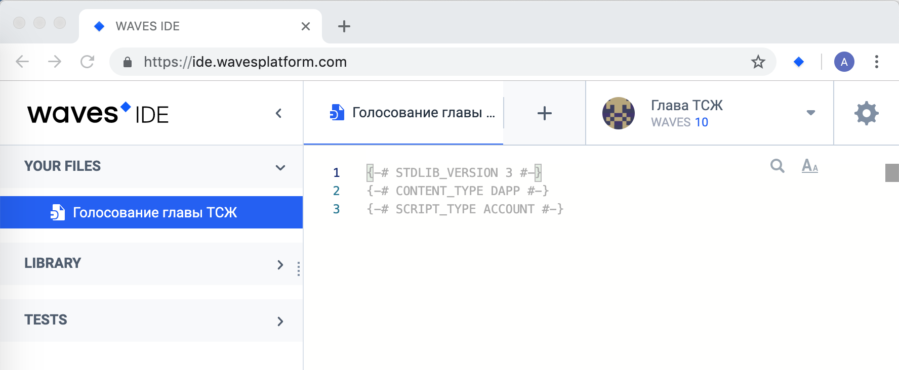

Замените автоматически сгенерированный код на следующий:

```ride
{-# STDLIB_VERSION 3 #-}
{-# CONTENT_TYPE DAPP #-}
{-# SCRIPT_TYPE ACCOUNT #-}

func voterIsAllowedToVote(voterPublicKey: ByteVector) = {

    let alekseiPubKey = base58'8QvKvspfNF6cUv2DFMCfvT8SrbraERqXpNMEMqBfJZ3e'
    let annaPubKey = base58'AtYwJTqWNfwYrPnWVvfmnPTSTEioiLFzUTcZVttgDj1x'

    if (voterPublicKey != alekseiPubKey && voterPublicKey != annaPubKey)
    then
        false
    else
        true

}

@Callable(i)
func vote(theVote: Int) = {

    if (!voterIsAllowedToVote(i.callerPublicKey))
    then
        throw("Вы не можете голосовать, так как вас нет в списке голосующих!")
    else
        let dataFromStorage = this.getInteger(i.callerPublicKey.toBase58String())

        if (dataFromStorage.isDefined())
        then
            throw("Вы уже голосовали! Повтороное голосование запрещено.")
        else
            WriteSet([DataEntry(i.callerPublicKey.toBase58String(), theVote)])

}
```

### Пояснения к коду dApp-скрипта

#### Функция `vote`

Функция `vote` возвращает [структуру](/ride/structures.md) `WriteSet`, внутри которой происходит запись голоса в [хранилище данных аккаунта](/blockchain/account/account-data-storage.md) главы ТСЖ.

Перед функцией `vote` указана аннотация `@Callable`, которая делает данную функцию вызываемой у dApp. У данной аннотации `i` — переменная, содержащая информацию о транзакции, которая вызвала функцию `vote`. Мы используем переменную `i` в коде для получения открытого ключа аккаунта `i.callerPublicKey`, который отправил транзакцию вызова скрипта.

Для простоты, в функции `vote` нет никаких проверок значения переменной `theVote`.

#### Функция `voterIsAllowedToVote`

Функция `voterIsAllowedToVote` проверяет, что аккаунт, вызывающий скрипт, имеет право голосовать.

В данном примере значения открытых ключей жестко прописаны в коде скрипта. В реальном примере можно было бы считывать открытые ключи, например, из хранилища данных аккаунта главы ТСЖ (предварительно записав их туда).

Значения открытых ключей `alekseiPubKey` и `annaPubKey` возьмите из карточек аккаунтов Алексея и Анны.

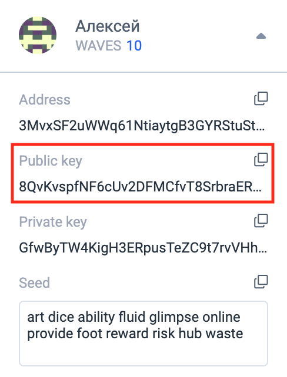

#### Функция `getInteger`

Функция `getInteger` получает значения из хранилища данных аккаунта по ключу:

```
let dataFromStorage = this.getInteger(i.callerPublicKey.toBase58String())
```

Размер и [сложность](/ride/base-concepts/complexity.md) скрипта отображаются в панели под редактором скрипта.


## 4. Привязка dApp-скрипта к аккаунту главы ТСЖ

Нажмите на кнопку **Deploy dAppscript**.

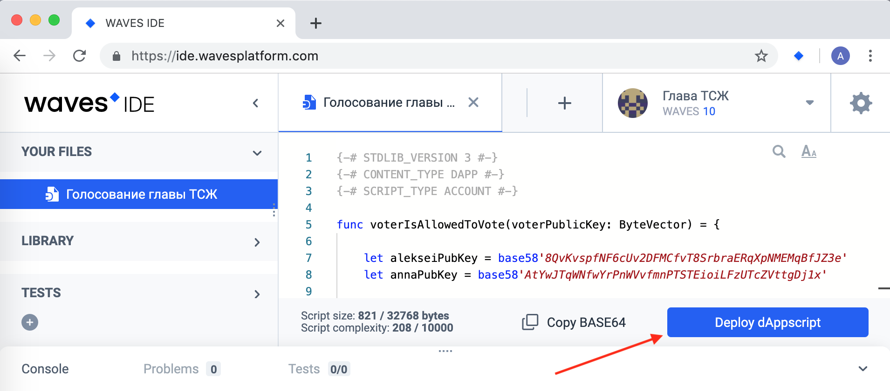

В открывшемся окне, в комбинированном списке **Account**, выберите значение "Глава ТСЖ". Подпишите транзакцию, нажав **Add sign**.

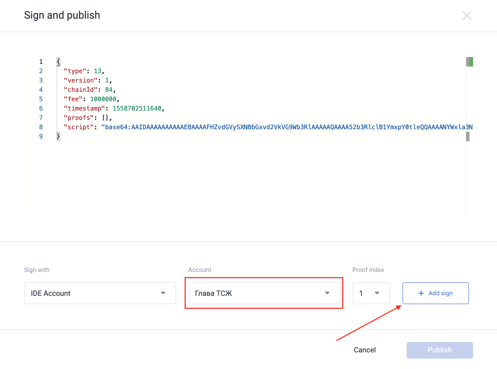

Отметим, что подписать транзакцию можно также секретной фразой или с помощью [Waves Keeper](/waves-keeper/about-waves-keeper.md).


Отправьте с аккаунта главы ТСЖ транзакцию установки скрипта, нажав **Publish**.


Таким образом, вы только что создали [dApp](/blockchain/account/dapp.md).

В [Waves Explorer](https://wavesexplorer.com/testnet), _в тестовой сети_, найдите информацию об активности на адресе главы ТСЖ. Для этого введите адрес главы ТСЖ в строку поиска и нажмите **Enter**.

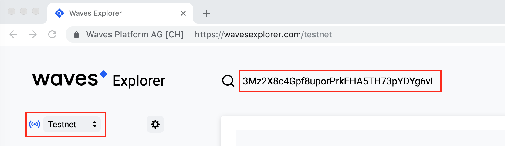

По адресу главы ТСЖ отображаются две транзакции: [транзакция перевода](/blockchain/transaction-type/transfer-transaction.md) (пополнение баланса на 10 WAVES с помощью faucet) и отправка транзакции установки скрипта. Отметим, что с баланса аккаунта главы ТСЖ списали комиссию за транзакцию установки скрипта в 0,001 WAVES.

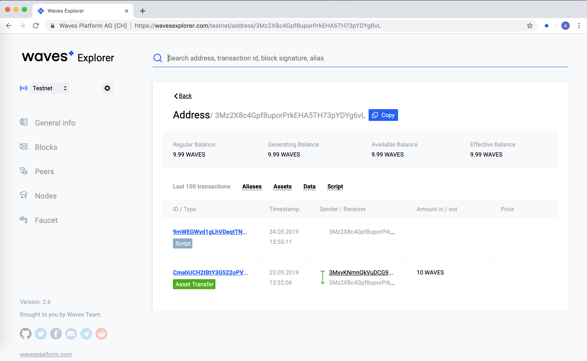

## 5. Голосование

Для того, чтобы проголосовать, жильцу необходимо отправить транзакцию вызова скрипта со своего аккаунта. В транзакции необходимо указать адрес dApp, имя вызываемого метода dApp, а также передаваемые в метод параметры.

Отправьте транзакцию вызова скрипта с аккаунта Алексея с помощью [REPL](/smart-contracts/tools/repl.md). Для этого в Waves IDE _выберите аккаунт Алексея_.

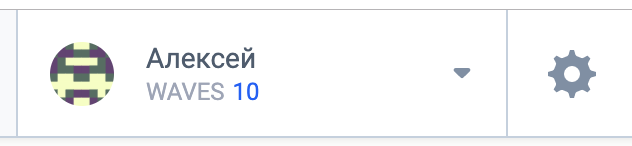

Далее в REPL выполните следующую команду:

```
broadcast(invokeScript({dApp: "3Mz2X8c4Gpf8uporPrkEHA5TH73pYDYg6vL", call: {function: "vote", args: [{type: "integer", value: 7}]} }))
```

Здесь `3Mz2X8c4Gpf8uporPrkEHA5TH73pYDYg6vL` — адрес аккаунта главы ТСЖ.

Если все прошло успешно, то вы увидите следующий результат (разверните объект `Promise` в консоли):

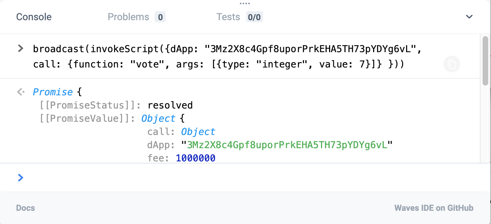

Аналогично проголосуйте с аккаунта Анны, _предварительно выбрав аккаунт Анны_ в Waves IDE:

```
broadcast(invokeScript({dApp: "3Mz2X8c4Gpf8uporPrkEHA5TH73pYDYg6vL", call: {function: "vote", args: [{type: "integer", value: 25}]} }))
```

Если вы попробуете повторно проголосовать с аккаунтов Алексея или Анны, то вы увидите ошибку:

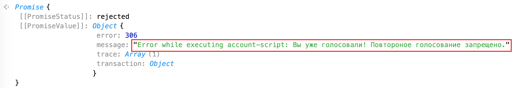

Если вы попробуете проголосовать с аккаунта главы ТСЖ, то вы увидите ошибку:

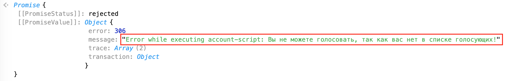

## 6. Просмотр результатов голосования

На вкладке **Data** в Waves Explorer просмотрите содержимое хранилища данных аккаунта главы ТСЖ — в хранилище данных содержатся две записи.

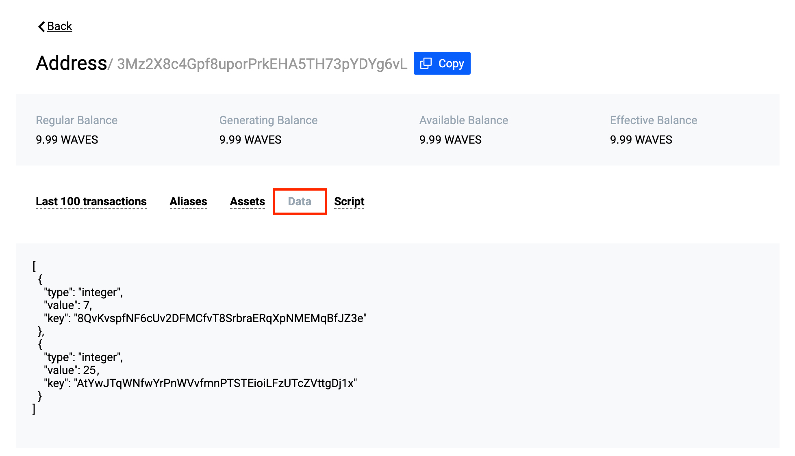
