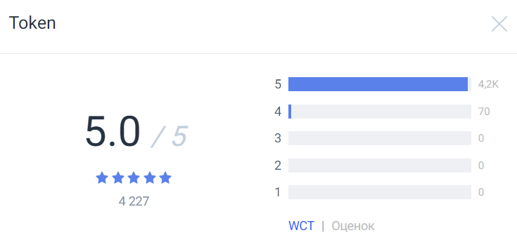

# Формула расчета рейтинга

Рейтинг токена есть суточное средневзвешенное значение отдельных оценок всех пользователей, когда либо оценивавших этот токен:

R = (R1W1 + R2W2 + ... + RnWn) / (W1 + W2 + ... + Wn),

где

Rn — оценка n-го пользователя,

Wn — вес оценки n-го пользователя.

Полученное значение `R` округляется до десятых долей числа.

## Оценка пользователя Rn

Пользователь выставляет оценку токену Rn внутри карточки токена при помощи звездочек и кнопки **Оценить**. Rn принимает целые значения от 1 до 5 включительно.

Пользователь может оценивать один и тот же токен много раз — в расчет будет браться самая последняя оценка.

Пользователь может оценить любой токен из браузера, в котором установлен [Waves Keeper](/waves-keeper/about-waves-keeper.md), если на балансе его аккаунта не меньше 1 [WCT](/blockchain/token/wct.md). Токены WCT при оценке не списываются, но их количество влияет на Wn.

## Вес оценки пользователя Wn

Величина Wn рассчитывается по формуле:

Wn = Bnkn,

где

Bn — эффективный баланс n-го пользователя в токенах WCT,

kn — весовой коэффициент n-го пользователя.

Полученное значение Wn округляется до целого числа.

## Эффективный баланс пользователя Bn

Эффективный баланс Bn — это баланс токенов WCT на момент выставления оценки, минус сумма всех расходных операций в WCT в течение следующих 24 часов.

Если Bn < 1, то оценка не будет учитываться при расчете рейтинга токена.

## Весовой коэффициент пользователя kn

Величина коэффициента kn зависит от величины эффективного баланса Bn оценивающего и рассчитывается по формуле:

|Величина эффективного баланса Bn оценивающего|Значение весового коэффициента kn|
| --- | --- |
| [1 — 100] | 1 |
| (100 — 35,000] | – 0.086 × ln(Bn × 2 ) + 1.66|
| (35,000 - 150,000] | – 0.0705 × ln(Bn) + 1.34 |
| (150,000 — 420,000] | – 0,00019 × Bn + 162.77 |
| (420,000 - 580,000] | – 0,00011 × Bn + 128.56 |
| (580,000 — ∞) | 0,0621 |

Полученное значение kn округляется до сотых долей числа.

## Пример расчета рейтинга токена

**Пользователь 1** оценил токен в 5 звезд. На момент голосования на его балансе было 10 000 WCT.

За 24 часа было 3 операции: расход 300 WTC, расход 200 WTC и доход 500 WTC. Получается, расходные операции составляют 300 + 200 = 500 WTC. Таким образом 9 500 WCT — это эффективный баланс B1 (несмотря на то что на балансе через 24 часа остались те же 10 000 WCT, что и на момент выставления оценки).

B1 находится в диапазоне 100 - 35,000, значит рассчитываем k1 по формуле:

k1 = -0.086 × ln(9,500 × 2) + 1.66 = -0.086 × 14.2137118 + 1.66 = 0.43762

Вес оценки:

W1 = B1 × k1 = 9,500 × 0.43762 = 4,157

Итого: токен получил от пользователя 1 оценку 5 с весом 4,157.

**Пользователь 2** оценил тот же токен в 4 звезды. На момент голосования на его балансе было 7 WCT.

За 24 часа расходных операций не было, значит эффективный баланс B2 равен 70 WCT.

B2 находится в промежутке 1 — 100, в этом случае:

k2 = 1

Вес оценки:

W2 = B2 × k2 = 70 × 1 = 70

Итого: токен получил от пользователя 2 оценку 4 с весом 70.

Рейтинг `R` токена будет рассчитываться как средневзвешенное значение оценок, выставленных обоими пользователями:

R = (5 × 4,157 + 4 × 70) / (4,157 + 70) = 4,983 (округляется до 5,0)

Количество WCT, выставивших оценку 5 будет 4,157, оценку 4 — 70, а общий вес WCT — 4227:

